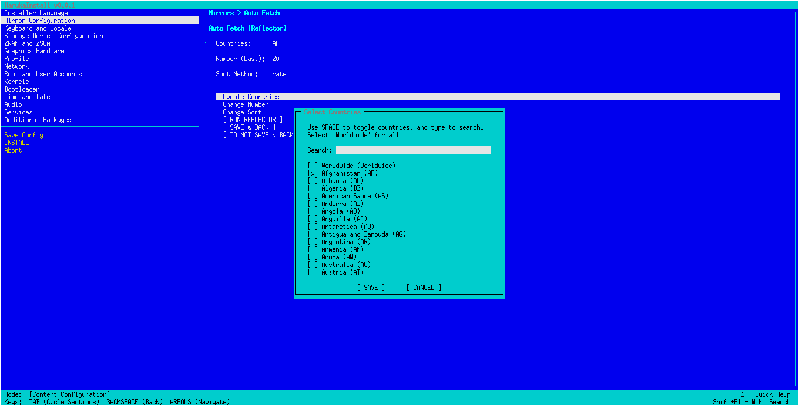
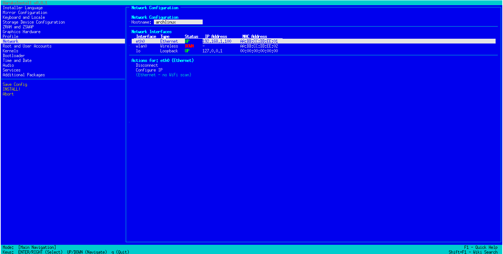
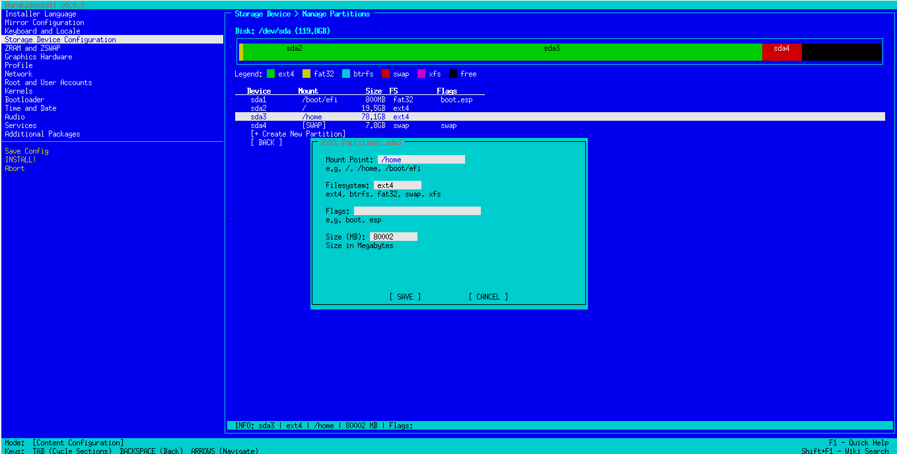

# HarukaInstaller

> [!WARNING]
> This project is a work in progress and **is** not for production use
>
> Even if previous commits may sound it's meant for every distro  
> This one is only targeting Arch Linux as a main priority
>
> This README is not yet done.

> [!IMPORTANT]
> While This Project now is called HarukaInstaller, **It's still** called `uli-git` in the AUR Repo
>
> DO NOT MAKE A DUPLICATE AUR REPO, `uli-git` is the only official AUR Repo for this Project, unless announced otherwise. I will also request a takedown if an unauthorized AUR repo is made. Also, the maintainer should be `mizumo_prjkt` on the AUR Account.
>
> **UPDATE**: The feature regarding on the distro agnostic install features have been revoked, since other distros tend to be messy, and it's a pain in the butt to maintain. But i could reconsider again in the future, but for now, **it's Arch Linux only.**

HarukaInstaller, formerly known as ULI or Universal Linux Installer, is yet another Linux Installer, that aims to of course, install a Linux Distro, but with "unsafe" C++

## Why make this?

As an avid Arch Linux User btw^tm, `archinstall` was the pain in the butt, It is sometimes freaks out after i'm done cherry-picking what i needed, only to either shit itself because, i did not set a NTP, or there was a problem in the mirror list, or `arch-chroot` decides to just declare archinstall as "I don't know who you are".

Since this archinstall was made in python, i already had nightmares with the other Python-Based Installers, like Calamares, which i struggled to use it. One time it took 2 days to finish an install, which to break it down, few minutes, i'm done configuring, then the process is so damn fucking slow.

So, i was like screw it, let's make my own installer in C++ and have it my way.

### Wait, why C++?

Closer to metal baby. Also at least i don't have to deal with dependency hell.

## How it works

HarukaInstaller (also formerly known as ULI), uses native tools in the distro's disposal.

For example, on Arch Linux, it uses `pacstrap` to install the base system, `genfstab` to generate the fstab file, `arch-chroot` to chroot into the new system, etc.

But this one has this unique quirks. It has YAML parsing capability. Which means, it can be installed with a YAML file as an instruction.

I usually reinstall sometimes, so a handy unattended install is a nice touch (archinstall has it but its a pain in the butt.)

## Screenshots

> [!NOTE]
> The screenshots right now are not final since this is still in development!

